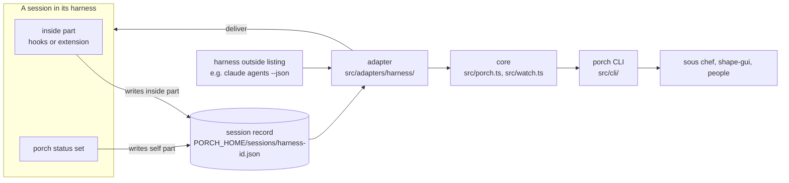

# Architecture

Porch answers two questions about agent sessions on this machine, whatever harness they run in: "what is this session doing, and does it need something?" and "please give it this message". It is a command (`porch`, JSON output) with a library under it. It does not store messages, launch sessions or judge them; tools such as sous chef do that on top.

## The pieces

- **Adapters** (`src/adapters/<harness>/`, contract in `src/adapter.ts`): one per harness. Each has an inside part that runs within the session and writes its record, and an outside part that lists sessions, observes them, delivers messages and works out which session a command runs in. The adapters Porch ships are listed in `src/adapters/index.ts`: Claude Code (`docs/domains/claude-adapter.md`) and the fake adapter for tests (`docs/domains/fake-adapter.md`); the Pi adapter comes next. How to write one: `docs/patterns/adapter-contract.md`.
- **Session records** (`src/records.ts`): one JSON file per session. The inside part writes its `inside` part; `porch status set` writes its `self` part. Details: `docs/domains/session-records.md`.
- **The core** (`src/porch.ts`): asks every adapter and combines the answers. `list` reports an adapter whose listing fails, and any session record it cannot read, in `errors` instead of failing the whole command or dropping the record silently. `observe` and `deliver` find the one adapter that knows the session; two adapters knowing the same id is an `ambiguous-session` error unless `--harness` picks one. One adapter failing does not hide a session another adapter knows; if no adapter knows the session and one could not be asked, `deliver` says `failed` (not `not-running`, which would be a guess) and `observe` gives an `internal` error naming the harness. `current` asks every adapter's `current`; if more than one claims the process, it refuses to guess (see "Known limits").
- **The CLI** (`src/cli/run.ts`, run by `src/cli/main.ts`): thin commands over the core, plus any commands adapters add (`porch hooks claude` and the hook commands it prints, `porch fake ...`; `porch install pi` later). The output contract, error shape and exit codes: `docs/reference/cli-output.md`.
- **The conformance suite** (`src/conformance/`): the same cases run against every adapter through a harness driver, with record and replay of harness output. `docs/patterns/conformance.md`.

## How the main operations work

**Observe and list.** The adapter reads the session records for its harness and, where the harness has one, its outside listing, and combines them into an observation: `status` and `since`, a small `detail`, the harness output as it came in `raw`, and the session's self-reported state in `self`. The outside listing decides whether a session is alive, so a session that crashed and left its record behind shows as `gone`. Where Porch cannot tell, the status is `unknown`.

**Deliver.** `porch deliver <session> --from <label> <text>` prefixes the text with `[from <label>] ` (no harness has a sender field for outside senders) and hands it to the adapter, which sends it the harness's way. The result says only what Porch can know: `delivered` with the session's status at the moment of sending, `not-running`, or `failed` with a reason. It never claims the message was read or started a turn; a message held at a prompt shows afterwards through `observe` as `waiting-on-prompt`. `guessed: true` marks a delivery address that was worked out rather than recorded by the session. Porch keeps no copy of the message: callers store it first.

**Status set.** `porch status set <status> [text]` runs inside a session. The core asks each adapter's `current` which session that is (each harness sets its own environment variable: `CLAUDE_CODE_SESSION_ID` for Claude Code, `PORCH_FAKE_SESSION_ID` for the fake), then writes the record's `self` part. Nothing else writes that part, and `porch status set` writes nothing else.

**Watch.** `porch watch [--session <id>] [--harness <h>]` stays running and prints one observation per line whenever a session changes (`src/watch.ts`). It looks again when a file in the records folder changes (a file watch, so an inside part's write shows at once), when an adapter's extra watched paths change, every `pollIntervalMs` for adapters whose outside listing shows things no record does (a session dying without its end hook, a prompt opening), and on a slow backstop poll in case a file event is missed. Each look compares every session with what it last printed, ignoring `raw`; a session that disappears from its adapter's listing is printed once as `gone`, with `since` and `detail` null because neither is known, and then forgotten, so a long-running watch does not keep every session it ever saw; a session already printed as `gone` (for example a crashed one whose record is later removed) is forgotten without a second `gone` line. It prints the current state of every session when it starts. An adapter whose listing fails keeps its last state, and the error goes to stderr as JSON.

## Data

- Records folder: `$PORCH_HOME/sessions/` (default `~/.porch/sessions/`), from `src/home.ts`. Tests always point `PORCH_HOME` at a scratch folder.
- Record format: `schemas/record.schema.json`, described in `docs/domains/session-records.md`.
- Output formats: one JSON Schema per output in `schemas/`.

## Decisions

- Decision 0001 (each adapter's inside part writes a per-session record, and the CLI reads the records).
- Decision 0002 (TypeScript on npm, a JSON CLI first with a thin library on top).
- Decision 0003 (its own repo, private until the second harness passes the shared tests).
- Decision 0004 (Porch writes self-reported state, with one writer per part of the record).
- Decision 0005 (publishing to npm waits until the second harness passes the shared tests).

## Known limits

- **Required checks are not enforced while the repo is private.** GitHub refuses rulesets and branch protection for private repos on Dylan's plan. CI still runs on every PR. Details, and how to turn it on when the repo goes public: `docs/operations/ci.md`.
- **Nested sessions.** If a harness session is started from inside another harness's session, a command in the inner one can see both harnesses' session variables. `porch current` then returns an `ambiguous-session` error and `porch status set` refuses, rather than guessing. This could be lifted by having each adapter's `current` also report the harness process id and picking the nearest ancestor process.
- **Record locks.** A writer that crashes while holding a record's lock leaves a `.lock` file. The next writer breaks it once it is older than 2 seconds and its writer's process is no longer running, or once it is older than 30 seconds whatever the process (`withLock` in `src/fsutil.ts`), so writes to that record are delayed, not lost. Breaking moves the lock aside and checks it is still the stale one, and a writer deletes only a lock holding its own token, so writers do not delete each other's fresh locks. One narrow case is left: if three writers race around a stale lock at the same instant, one could put back a lock while another has just taken a new one, and two could write at once, losing one change. This is accepted as unlikely.
- **Real-harness conformance** runs only where the harness is installed and logged in (for Claude Code, also from a checkout inside a folder Claude Code trusts), and in the scheduled workflow once the API key secret exists. The Claude Code adapter's own limits are in `docs/domains/claude-adapter.md`.
